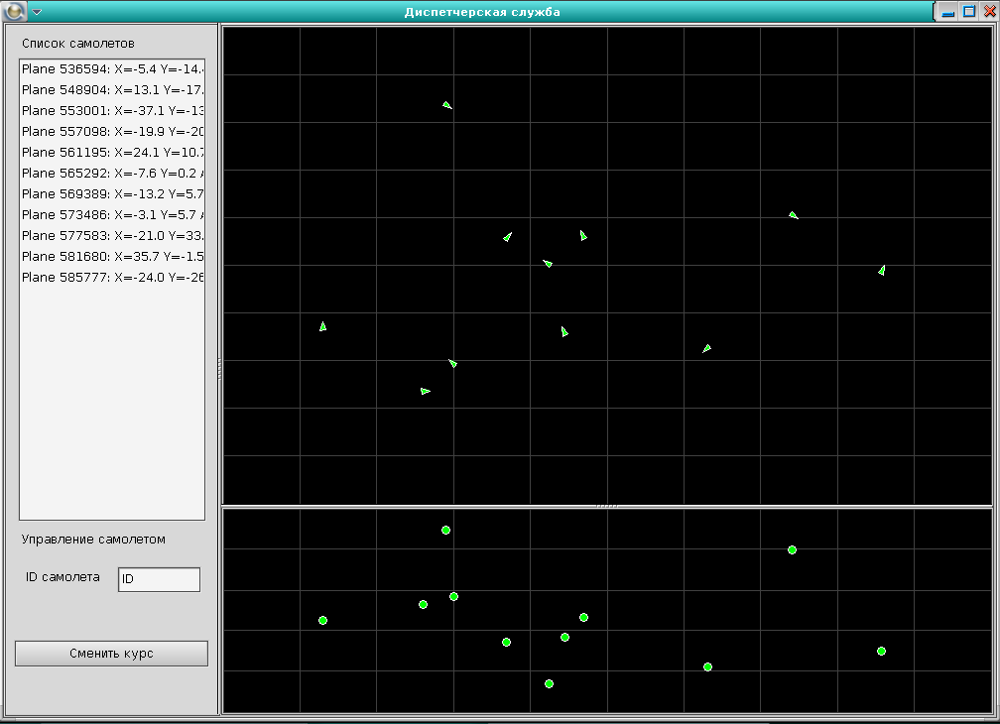
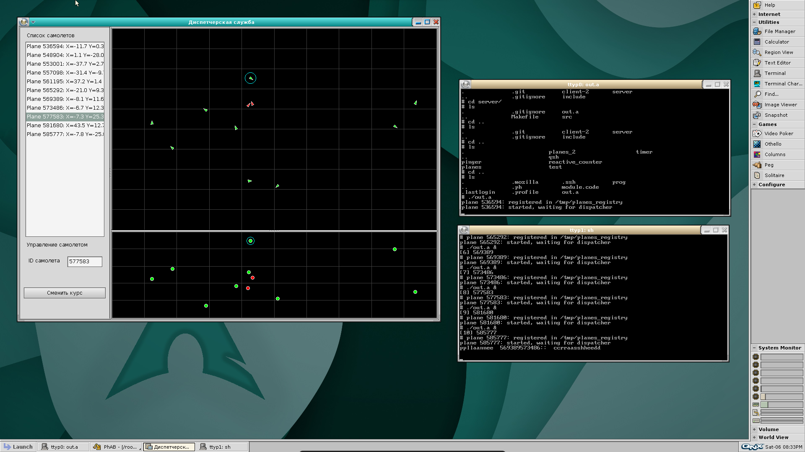

# avia-manager

Учебная диспетчерская служба воздушного движения под QNX Neutrino. Каждый самолёт это отдельный процесс, который сам себя двигает по зоне, а клиент диспетчера с графическим интерфейсом на Photon опрашивает их, рисует обстановку и следит за опасными сближениями.

Вся связь между процессами идёт нативным QNX IPC, без сокетов и без общей памяти.

## Скриншоты

Окно диспетчера. Слева список самолётов, справа сверху вид сверху, справа снизу вид по высоте.



Всё вместе на рабочем столе QNX: запущенные процессы самолётов в терминалах и клиент. Красные точки это самолёты, которые сошлись ближе аварийной дистанции.



## Стек

- C++ в старом стиле, из STL только map, set, vector и string
- QNX Neutrino и его IPC: ChannelCreate, ConnectAttach, MsgSend, MsgReceive, импульсы от таймера
- Photon microGUI, интерфейс собран в PhAB, это визуальный редактор из состава QNX
- make поверх сборочной системы QNX, recurse.mk и qphabtarg.mk

## Как запускать

Собирается и работает только под QNX. На Linux не соберётся, там нет ни Photon, ни neutrino.h.

Процесс самолёта, из папки server:

```
make
```

Небольшая оговорка: в Makefile в зависимостях указан src/lib.h, которого в репозитории нет, так что make может ругаться. Тогда собирайте напрямую той же командой, что в правиле:

```
g++ src/main.cpp -o program -ph
```

В репозитории лежит уже собранный бинарник out.a, на скриншотах запускался именно он.

Клиент, из папки client-2, обычной сборкой QNX:

```
make
```

Либо открыть client-2/abapp.wsp в PhAB и собрать оттуда, так удобнее если нужно править интерфейс.

Порядок запуска:

1. Удалить /tmp/planes_registry, если он остался с прошлого раза. Сам он не чистится, а старые записи будут мешать
2. Запустить нужное число процессов самолётов в фоне. Каждый может принять параметры -id, -x и -y, без них позиция и курс выбираются случайно
3. Запустить клиент диспетчера

Самолёты записывают в /tmp/planes_registry строку вида plane_id pid chid, клиент читает этот файл и подключается к каждому через ConnectAttach.

## Структура папок

- server/src/main.cpp - процесс одного самолёта. Создаёт канал, регистрируется в файле, раз в секунду по импульсу таймера сдвигает себя, отвечает на запросы состояния и на команды
- server/src/ipc_protocol.h - структуры сообщений, общие для обеих сторон
- client-2/src - клиент диспетчера
  - abmain.cc, abcalls.cc и файлы ab*.h - каркас, сгенерированный PhAB, плюс тонкие обёртки, которые перекидывают колбэки в реальный код
  - dispatcher_app - синглтон приложения. Тик таймера, выбор самолёта в списке, клик по карте, кнопка смены курса
  - ipc_manager - подключение к самолётам и опрос их состояний
  - plane_controller - реестр самолётов, их статусы и отправка команд
  - collision_detector - поиск опасных сближений
  - visualization - отрисовка вида сверху и вида по высоте в виджете PtRaw
- client-2/abapp.wsp, abapp.dfn, wgt - файлы проекта PhAB. Руками их лучше не трогать, они бинарные и правятся через редактор

## Особенности

- Зона 100 на 100 километров, самолёты идут со скоростью 800 км/ч и отражаются от границ. Высота от 1000 до 9000 метров, в полёте не меняется
- Расстояние между самолётами считается трёхмерное, высота при этом переводится в километры. Ближе 5 км это предупреждение, ближе 2 км авария
- При аварии клиент шлёт обоим самолётам MSG_COMMAND_CRASH, и те корректно завершаются
- Если самолёт не отвечает 5 секунд, ему ставится статус OFFLINE, на карте он становится серым, но из списка не пропадает
- Опрос односторонний. Самолёты никогда не пишут первыми, клиент сам раз в тик запрашивает у каждого состояние через MsgSend и ждёт ответа
- Регистрация через файл в /tmp сделана намеренно просто, вместо полноценного сервера имён. Файл открывается с flockfile, чтобы несколько самолётов не перемешали строки
- Кнопка смены курса разворачивает выбранный самолёт ровно на 180 градусов. Выбрать самолёт можно и в списке, и кликом по карте, попадание считается hit-тестом по экранным координатам
- Цвета на карте: зелёный это норма, жёлтый предупреждение, красный авария, серый потерянная связь. Выделенный самолёт дополнительно обводится голубым кольцом
